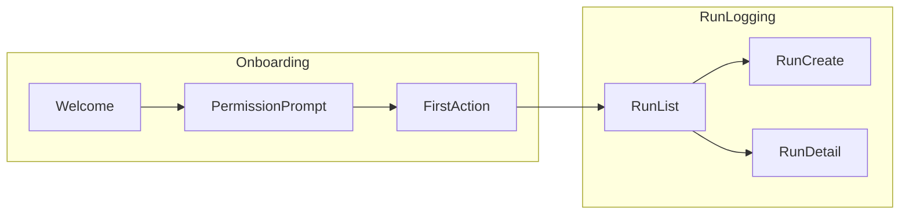

# Phase 3 — Cross-Feature Review

Final pass after all per-feature PRDs are written. Generate navigation graph, surface shared
components, detect conflicts, write master INDEX.

## Process

1. Read all `plans/{slug}/prd/{NN}-*.md` files
2. Extract from each PRD: feature slug, screens (name + entry + exit + primary actions)
3. Build navigation graph
4. Detect shared components
5. Detect naming conflicts
6. Write `nav-graph.mmd` and `INDEX.md`

## Navigation Graph (`nav-graph.mmd`)

Mermaid LR flowchart. Nodes = screens (across all features). Edges = navigation derived from
entry/exit lists.

**Constraints:**

- LR flowchart only (no advanced Mermaid features — keeps rendering robust)
- Node IDs = `feature_slug__screen_name` (snake_case, double-underscore separator)
- Node labels = screen name (display)
- Edges = `-->` (no edge labels in V1; keeps file simple)
- Group nodes by feature using `subgraph`

**Template:**



Save: `plans/{slug}/prd/nav-graph.mmd`

## Shared Components Detection

Scan all PRDs' "Primary actions" + screen layouts. Surface candidates:

- A button / dialog / list-row described in 2+ features → shared component candidate
- Output a "Shared Components" section in `INDEX.md` (suggestions only — student decides)

Example detection:

```
[Detected] "Login button" appears in Onboarding screens and Settings screens
→ Suggest: shared `LoginButton` component
```

Don't over-detect. Generic UI elements (Button, TextField) are framework-level, NOT app-shared. Only
surface app-specific reusable elements.

## Naming Conflict Detection

Scan all screens across all features:

- Same screen name in 2 features → conflict
- Suggest disambiguation (e.g., `Detail` → `RunDetail` and `WorkoutDetail`)

## Cross-Feature Dependencies

Detect explicit cross-feature jumps:

- A screen's exit points to a screen in another feature → dependency
- Example: `onboarding__first_action --> run_logging__list` means Onboarding depends on RunLogging
  existing

List dependencies in INDEX as: `Onboarding → RunLogging`.

## Master INDEX (`INDEX.md`)

```markdown
---
title: "{Idea Title} — PRD Index"
generated: {YYYY-MM-DD}
features: {N}
screens: {M}
---

# PRD Index — {Idea Title}

Source idea brief: [`../idea-brief.md`](../idea-brief.md)
Navigation graph: [`./nav-graph.mmd`](./nav-graph.mmd)

## Features

| # | Feature | Bucket | Screens | PRD | Status |
|---|---|---|---|---|---|
| 1 | Onboarding | Activation | 3 | [01-onboarding.md](./01-onboarding.md) | draft |
| ... |

## Cross-Feature Dependencies

- Onboarding → RunLogging (first action enters run list)
- ...

## Shared Components (suggestions)

- `LoginButton` — used in Onboarding and Settings
- `RunCard` — used in RunLogging and ProgressDashboard
- ...

## Naming Conflicts

- None detected. (or list with disambiguation suggestions)

## Next Steps

→ Run `kta-design-spec` to generate per-screen design specs feeding AI design tools.
```

Save: `plans/{slug}/prd/INDEX.md`

## Validation

Before writing INDEX:

- All PRDs read successfully (no parse errors)
- nav-graph.mmd renders (basic syntax check — count `flowchart`, `-->`, balanced subgraphs)

If validation fails → print which PRD failed parse, ask student to fix, re-run Phase 3.

## Print Final Summary

```
[kta-prd-pipeline] All phases complete.
✓ 6 PRD files written
✓ nav-graph.mmd written ({N} nodes, {M} edges)
✓ INDEX.md written
✓ {K} shared component suggestions
✓ {C} cross-feature dependencies
✓ {X} naming conflicts {(none) | (see INDEX.md)}

Next: Run `kta-design-spec` to generate per-screen design specs.
```
